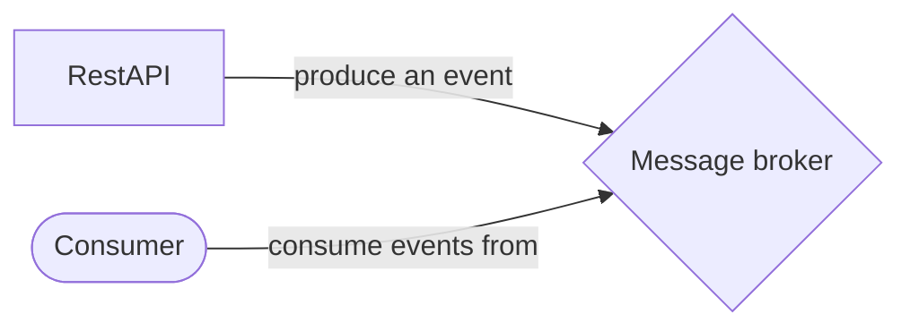

# Event-driven architecture demo

This project implements an Event-Driven architecture where you can see how it works while keeping the different parts separate, allowing communication between components from different contexts, each of which can use different technologies.

## Folder structure
This project contains:

    - root (this folder)
    |- /producer
    |- /consumer
    |- compose.yml
    |- README.md
    |- LICENSE

## The Producer (/producer)

It's a project based in SpringBoot v3.4.0 who expose a RESTApi to create orders. These Orders will be published into the producer as event to allow be consumed for all the comsumers located in their places.

## The Consumer (/consumer)

WiP

## How it's works
One message publisher (productor), publish messages (or event) and send to the message broker software. That's the publish action do. Once time message broker has the event in their topic, it's given to the consumer for processing and do the task related with the event type getted.


In event-driven architectures, you can scale as needed, with as many consumers and producers as required. This approach enables seamless communication between multiple software components (performing different tasks) while maintaining low latency and data integrity.

## Stating the system

This project is dockerized. So, that means you can up and down easily with simple commands.

### Starting
```shell
docker compose up -d
```

### Stopping
```shell
docker compose stop
```

### Monitoring Kafka

You have published in: [localhost:9000](http://localhost:9000) a software called: kafdrop. Kafdrop give a GUI to manage topics, partitions and messages into the Kafka cluster.

### Produce an event

The Orders RestAPI is published with a Swagger page in the [localhost:8081](http://localhost:8081/swagger-ui/index.html). From this page you can send rest request to produce events with new orders.

### Consumer

WiP