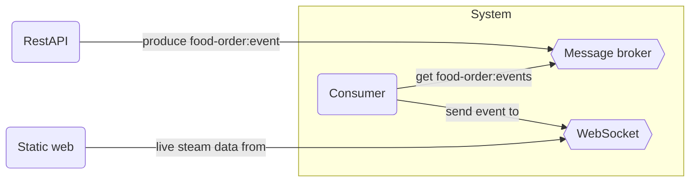

# Event-driven architecture demo

This project implements an Event-Driven architecture where you can see how it works while keeping the different parts separate, allowing communication between components from different contexts, each of which can use different technologies.

## Folder structure
This project contains:

    - root (this folder)
    |- /consumer
    |- /producer
    |- /static
    |- /websocket
    |- compose.yml
    |- README.md
    |- LICENSE

## The Producer (/producer)

It's a project based in SpringBoot v3.4.0 who expose a RESTApi to create orders. These Orders will be published using a producer as food-order events.

## The Consumer (/consumer)

TypeScript project supported by BunJS. It connect with message broker and consume events of food-order type. Then send the events to the websocket server. Other consumers will be can implemented to listen food-order events to do their domain logic, each of they require a new consumer following a cohesive implementation (each consumer do only one thing).

## Static website (/static)

It's a simple static html served by BunJS webserver to view in a GUI (Graphic User Interface) the events related with food-order. Connected with a websocket server is able to show information in real time.

## WebSocket server (/websocket)

This expose a websocket server created with TypeScript and BunJS. Their responsability is translade events from a consumer to a web environment in real-time with zero delay.

## How it's works
One message publisher (productor), publish events of food-order type to send to the message broker software. Once time message broker has the event in their topic the consumers listen for that kind of events processing it and do their task and actions.


In event-driven architectures, you can scale as needed, with all consumers as you need and producers too. This approach enables seamless communication between multiple software components (performing different tasks) while maintaining low latency and data integrity.

## Stating the system

This project is dockerized. That means you can start and stop easily with simple commands (plug and play).

### Starting
```shell
docker compose up -d
```

### Stopping
```shell
docker compose stop
```

### Monitoring Kafka

You have published in: [localhost:9000](http://localhost:9000) a software called: kafdrop. Kafdrop give a GUI to manage topics, partitions and messages into the Kafka cluster.

### How Produce an event

The Orders RestAPI has published a Swagger page at: [localhost:8081](http://localhost:8081/swagger-ui/index.html). Once time you are in it just:

1. Create a New Order
2. [Optional] Add more items, delete some others, play with the API if you want
3. If you finish, set order as closed.

When an Order is closed. One event of type food-order is created using a producer to publish into Kafka Customer-Order topic. After the event has been published the consumers listening for food-order events will take this information to do their actions.

You can see your orders created in live from the restaurant Order-TV at. [localhost:8080](http://localhost:8080)